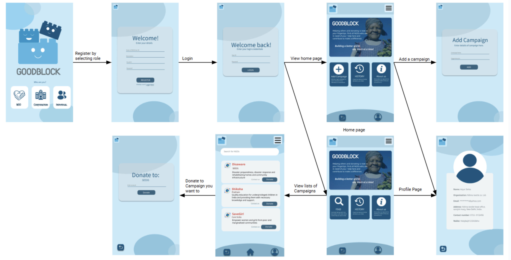

# CSN-254-GoodBlock
## Building a new world, one block at a time!
### This app aims to let the donors do hassle free transactions with the NGOs, knowing which campaign to donate and is in need of donation. The idea for GoodBlock originates from the noble vision of making the world a better place for one and all by providing a platform where individuals and corporations can donate money towards social causes.
#### Tech stack:
- Frontend has been written in Flutter framework (using dart) and backend in Solidity.
- Data has been stored in Solidity, using blockchain technology.
#### Steps to use:
- clone the repo: `git clone https://github.com/Mehak-4545/CSN-254-GoodBlock/`
- check for flutter dependencies: `flutter pub get`
- choose the right directory: `cd my-app`
- run flutter commands : `flutter run` ( it runs the main.dart file )
#### App flow:

#### Branches:
- frontend: this branch has all the working frontend with database queries/ backend hardcoded.
- contracts: this branch has the set of contracts and the entire backend.
- contrac_flutter : this branch was used for backend testing purpose.
- main: it has final working code.
- integration: it has integrated code.
